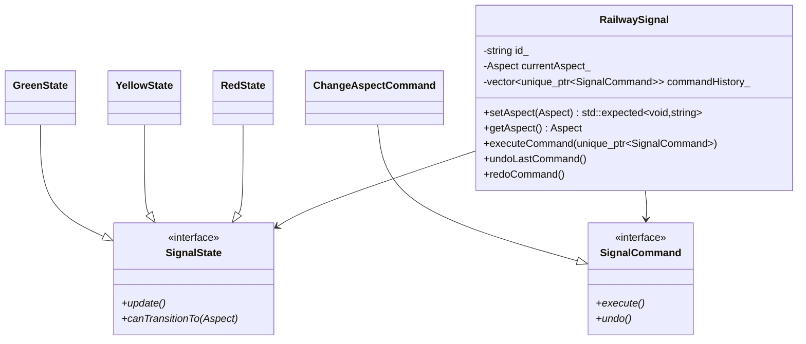

# Documentation des Classes
## Table des Matières
- [RailwaySignal](#railwaysignal)
- [SignalCommand](#signalcommand)
- [SignalState](#signalstate)
- [StateValidator](#statevalidator)
- [SafetyTimer](#safetytimer)

## RailwaySignal
`RailwaySignal` est la classe principale qui gère l'état et le comportement d'un signal ferroviaire.

### Énumérations
```cpp
enum class Aspect {
    RED,    ///< Signal fermé
    GREEN,  ///< Signal ouvert
    YELLOW  ///< Signal à vitesse limitée
}
```

### Constructeur
```cpp
explicit RailwaySignal(const std::string& id)
```
- **Paramètres**
  - `id`: Identifiant unique du signal
- **Description**: Initialise un nouveau signal avec l'état initial RED (sûr).

### Méthodes Publiques
#### setAspect
```cpp
std::expected<void, std::string> setAspect(Aspect aspect)
```
- **Paramètres**
  - `aspect`: Nouvel aspect à appliquer
- **Retour**: `std::expected` contenant succès ou message d'erreur
- **Safety Level**: SIL4
- **Description**: Change l'aspect du signal après validation des règles de sécurité.

#### getAspect
```cpp
Aspect getAspect() const
```
- **Retour**: L'aspect actuel du signal
- **Safety Level**: SIL4
- **Description**: Retourne l'état actuel du signal.

#### executeCommand
```cpp
void executeCommand(std::unique_ptr<SignalCommand> command)
```
- **Paramètres**
  - `command`: Commande à exécuter
- **Safety Level**: SIL4
- **Description**: Exécute une commande et l'ajoute à l'historique.

#### undoLastCommand/redoCommand
```cpp
void undoLastCommand()
void redoCommand()
```
- **Safety Level**: SIL4
- **Description**: Gère l'annulation et la réexécution des commandes.

### Signaux
```cpp
boost::signals2::signal<void(Aspect)> aspectChanged
```
- **Description**: Notifie les observateurs des changements d'aspect.

## SignalCommand
Interface abstraite pour le pattern Command.

### Méthodes Virtuelles
```cpp
virtual void execute() = 0
virtual void undo() = 0
```

### Classes Dérivées
#### ChangeAspectCommand
```cpp
class ChangeAspectCommand : public SignalCommand
```
- **Description**: Implémente une commande de changement d'aspect.
- **Safety Level**: SIL4

## SignalState
Interface abstraite pour le pattern State.

### Méthodes Virtuelles
```cpp
virtual void update() = 0
virtual bool canTransitionTo(Aspect aspect) = 0
```

### Classes Dérivées
#### RedState
- **Transitions Autorisées**: Vers YELLOW uniquement
- **Safety Level**: SIL4

#### YellowState
- **Transitions Autorisées**: Vers RED ou GREEN
- **Safety Level**: SIL4

#### GreenState
- **Transitions Autorisées**: Vers YELLOW ou RED (urgence)
- **Safety Level**: SIL4

## StateValidator
Classe utilitaire pour la validation des transitions.

### Méthodes Statiques
```cpp
static bool validateTransition(Aspect from, Aspect to)
```
- **Description**: Valide les transitions selon la matrice de sécurité.
- **Safety Level**: SIL4

## SafetyTimer
Classe utilitaire pour la gestion des timeouts de sécurité.

### Constructeur
```cpp
explicit SafetyTimer(std::chrono::milliseconds timeout)
```

### Méthodes
```cpp
bool hasExpired() const
void reset()
```

## Diagrammes de Classes

