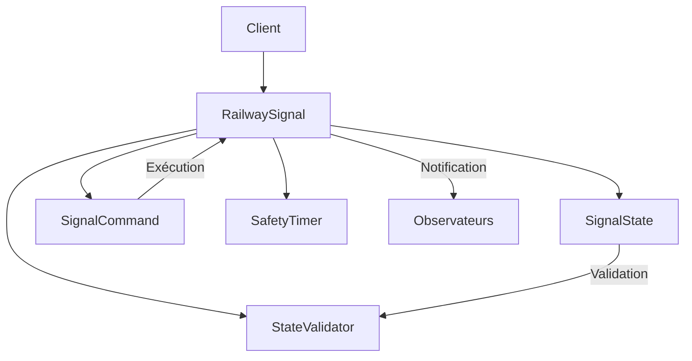
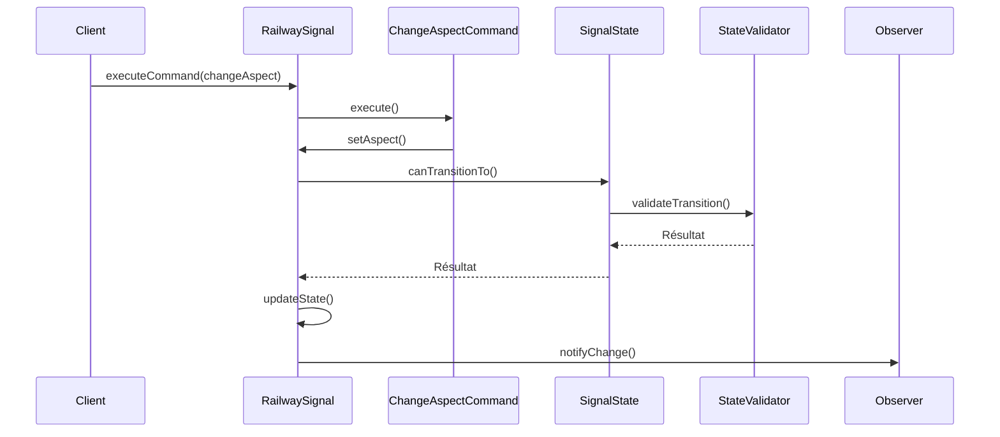

# Documentation de Conception

## Patterns de Conception
### Command Pattern
Utilisé pour :
- Réversibilité des opérations
- Traçabilité des changements
- Audit de sécurité

### State Pattern
Implémente :
- Validation des transitions
- Encapsulation des règles métier
- Séparation des responsabilités

### Observer Pattern
Via boost::signals2 pour :
- Notification des changements d'état
- Découplage des composants
- Monitoring en temps réel

## Architecture

## Flux de Données
### Changement d'État

